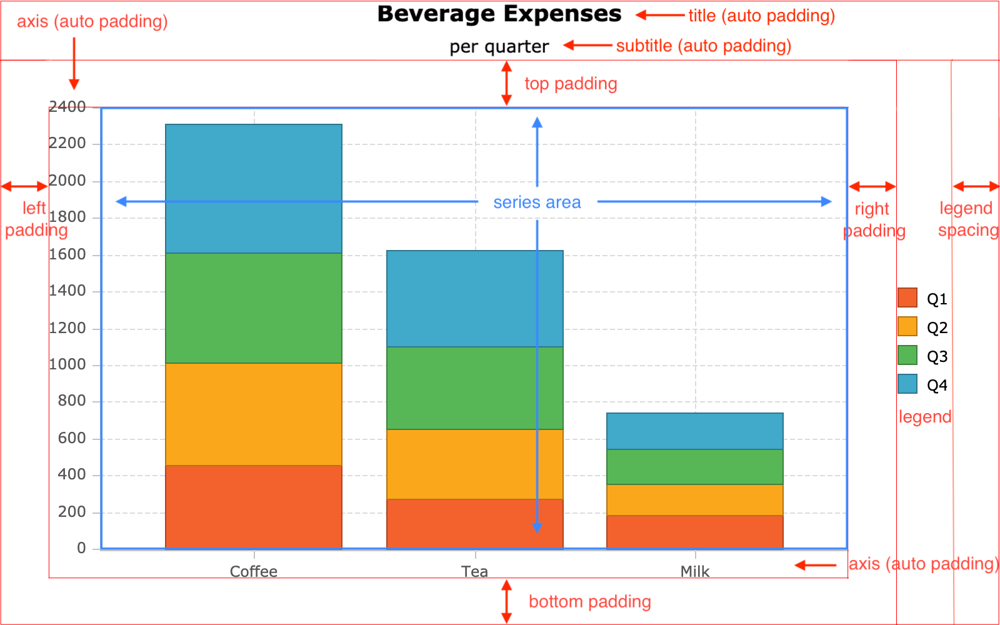

This section explains the different components that a chart is made up of and how they are laid out inside a chart.

## What makes a chart?



Each chart is composed of a single or multiple series, and optionally a legend, axes, and captions, such as title and subtitle. All of these components are managed by the chart's layout engine and are sized and positioned appropriately based on the chart's dimensions, the nature of the data and the configuration.

To get the desired results when a chart is resized or the data changes, it helps to understand the way the layout works.

For example, given the data:

```js
var data = [
  {
    beverage: "Coffee",
    Q1: 450,
    Q2: 560,
    Q3: 600,
    Q4: 700,
  },
  {
    beverage: "Tea",
    Q1: 270,
    Q2: 380,
    Q3: 450,
    Q4: 520,
  },
  {
    beverage: "Milk",
    Q1: 180,
    Q2: 170,
    Q3: 190,
    Q4: 200,
  },
];
```

We can create the chart pictured above using the following chart factory config:

```js
AgChart.create({
  data: data,
  container: document.body,
  title: {
    text: "Beverage Expenses",
  },
  subtitle: {
    text: "per quarter",
  },
  padding: {
    top: 40,
    right: 40,
    bottom: 40,
    left: 40,
  },
  series: [
    { type: "column", xKey: "beverage", yKey: "Q1", stacked: true },
    { type: "column", xKey: "beverage", yKey: "Q2", stacked: true },
    { type: "column", xKey: "beverage", yKey: "Q3", stacked: true },
    { type: "column", xKey: "beverage", yKey: "Q4", stacked: true },
  ],
  legend: {
    position: "right",
    spacing: 40,
  },
});
```

<chart-example title='Basic Column Chart' name='basic-column' type='generated'></chart-example>

## Series

It wouldn't be incorrect to say that the chart is the series itself, and all the other chart components such as axes, legend and captions just help to make sense of the data represented by the series. The series alone can fill the whole area of the chart (which is the case with sparklines, for example), but when you start adding all these other components to the chart, you need to make space for them. The series have to be padded, so that there is enough space to show axis labels on the sides, and you probably want to add some extra padding on top of that, so that axis labels are not flush with the edge of the chart. That extra padding can be set using the `padding` config, which defaults to `20` on all sides but is set to `40` in our example for illustration purposes. The padding required to make space for axis labels on the other hand is calculated automatically.

## Legend

If we want to have a legend in our chart, the chart layout will add extra padding to the side of the chart that the legend is positioned at in order to accommodate the legend. The series are already padded on each side, so there will be some empty space between the series and the legend. However, you probably don't want the legend to be flush with the outer edge of the chart either. That's what the legend's `spacing` config is for, which defaults to `20`, but is set explicitly to `40` in our example. The legend `position` is also optional and defaults to `'right'`. In fact, the `legend` config itself is optional; the legend will be shown by default, but can be hidden using `legend: { enabled: false }`.

## Captions

When we add captions, such as title and subtitle, the layout figures out the amount of padding to add to the top of the chart automatically. There is no extra action for us to take.

## Size Changes

When the chart's size changes, the amount of user-specified padding doesn't change, so the auto padding amount typically doesn't change either, meaning it's only the series area that grows or shrinks on size changes.

By default, the chart will resize automatically to fill the container element. If either the `width` or `height` configs are set, auto-sizing will be disabled unless the `autoSize` config is explicitly set to `true`. Make sure to give the chart's `container` element an explicit size, otherwise you will run into a chicken and egg situation where the container expects to size itself according to the content and the chart expects to size itself according to the container.

## Next Up

Continue to the next section to learn about the [legend and its layout](/charts-legend/).
